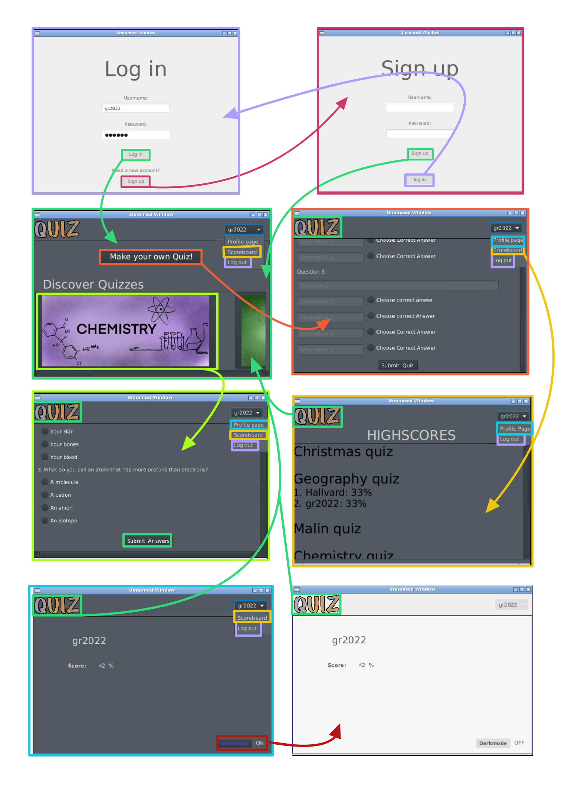
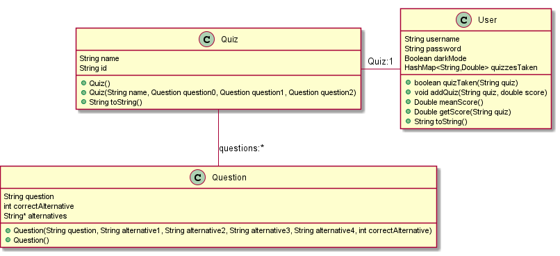
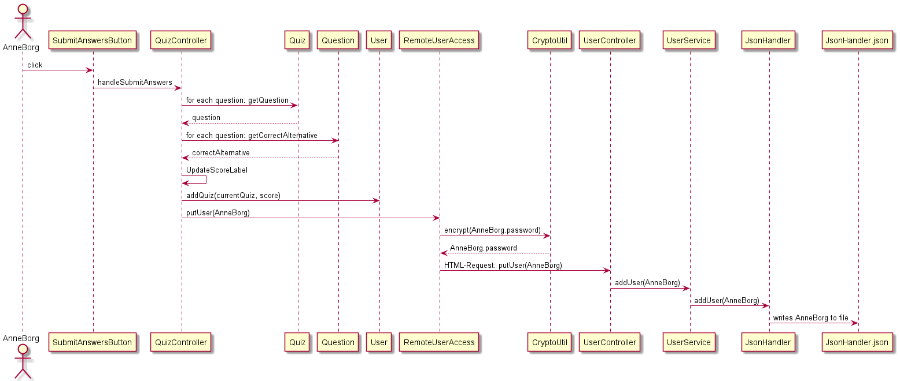
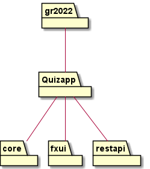

# quizapp

This project will contain a quiz app. 

Currently the repo contains a working quizapp.

This repo also contains testing for each layer, and is built with **maven**.

## To run this app:
from /workspace/gr2022/Quiz-app:
>mvn install

>mvn spring-boot:run -f restapi/pom.xml

>new Terminal

>cd Quiz-app

>mvn javafx:run -f fxui/pom.xml

## FolderStructure
**core/src/main/java**

**core/src/main/resources**

**core/src/test/java**

**fxui/src/main/java**

**fxui/src/main/resources**

**fxui/src/test/java**

**restapi/src/main/java**

**restapi/src/main/resources**

**restapi/src/test/java**

This is the standard folder structure for projects built with maven.

## Paths

In this app we use paths to access several different objects, but mostly json objects used to save data.

To access these objects we have used relative paths, such that the project is compatible with other programs if cloned.

# Backend / Frontend

The app is currently divided into three parts: Core, fxui with a dependency to core, and restapi, also with a dependency to core.

The backend of Quiz-app contains all of restapi, aswell as all of core, with the exception of CryptoUtil.java.

The frontend of Quiz-app contains all of restapi, aswell as all of core, bar the java classes that interact directly with .json files (Except for when DirectAccess is used in testing).

To communicate between the two layers, rest api is implemented via Spring-boot.

## UI-layer

Currently, the UI layer contains all the FXUI-controllers, the java files used to communicate with the rest api, and logic for checking Username/password.
The UI-layer has a dependency to core.

To log in, use the following:

Username: **gr2022**

Passord **gitlab**

## Persistance layer
All classes and logic connected to saving and reading from files are located in in the persistance-layer.

This layer also contains CryptoUtil. This is an encryption class used to ensure safe use of the restAPI. AES encryption is used here.

## Core
This layer contains the logic, User class, Quiz class and Question Class.

## Restapi
All files connected to saving and Spring-boot are located in the restapi part of the repo. 

## Plan and functionality

**Illustrative plan:**

This illustrative plan is meant to represent the functunality of our app. The colored arrows show how different stages occur as a result of interactions with the visual representations. As an example, with the correct password and username, the user can access the main page via the login button. 

### Diagrams

Class diagram:
This class diagram illustrates the classes that, in our opinion, are the most important.
All classes located in core are represented by the diagram. The function of the diagram is to provide the reader with relevant information on quiz-app's core functionality.

Sequence diagram:
The sequence diagram illustrates an important scenario of this app. It shows the calls required to take place when a user takes a quiz. Both
frontend and backend is illustrated.

Package diagram:
This diagram shows the packages within the app.

## other
The class CryptoUtil.java uses AES encryption and is from https://howtodoinjava.com/java/java-security/java-aes-encryption-example/

The CSS Styles have links to the authors in their respective files.

### This project is built with maven