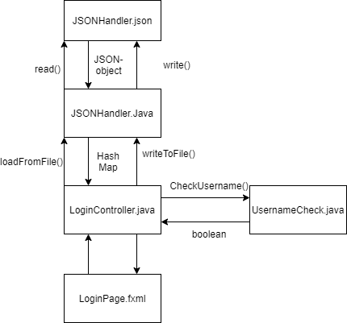

# quizapp

This project vil contain a quiz app. 

Currently the repo contains a working quizapp

This repo also contains testing for each layer, and is built with **maven**.

## To run this app:
from /workspace/gr2022/gr2022:
>mvn install
>mvn javafx:run -f fxui/pom.xml

## FolderStructure
**core/src/main/java**
**core/src/main/resources**
**core/src/test/java**

**fxui/src/main/java**
**fxui/src/main/resources**
**fxui/src/test/java**

This is the standard folder structure for projects built with maven

## UI-layer

Currently, the UI layer conatins the following: Signin page, signup page, main menu, a history quiz and profile page.

To log in, use the following:

Username: **gr2022**

Passord **gitlab**

## Presistance layer
In the presistance-layer, all classes and logic connected to saving and reading from files are located.

## Core
This layer contains the logic and the user class. 

**Diagram describing the file saving:**

## Plan and functionality

**Illustrative plan:**

This illustrative plan is meant to represent the functunality of our app at its current stage. The colored arrows show how different stages occur as a result of interactions with the visual representations. As an example, with the correct password and username, the user can access the main page via the login button. 

**User stories:**
https://docs.google.com/document/d/1onM4Twf8udwkJ4Me4JwiqlhbbePsnBw3_q8_uEFCKUw/edit?ts=5f58a80c

### This project is built with maven