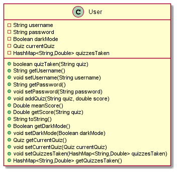
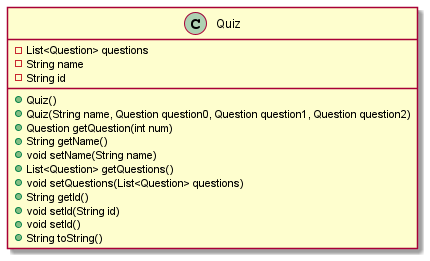
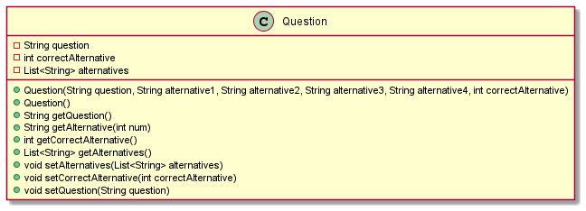

# Core

## User

This is the User class used throughout the project. Other than basic User functionality, it also has the method meanScore(), which returns the mean score of all the quizzes the user has taken

## Quiz 

This is the Quiz object used to load the quizzes on the main page

## Question

This class is nested in the Quiz class

