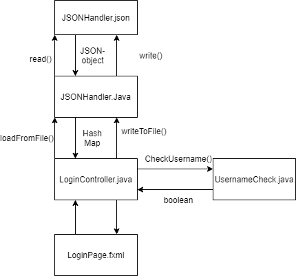
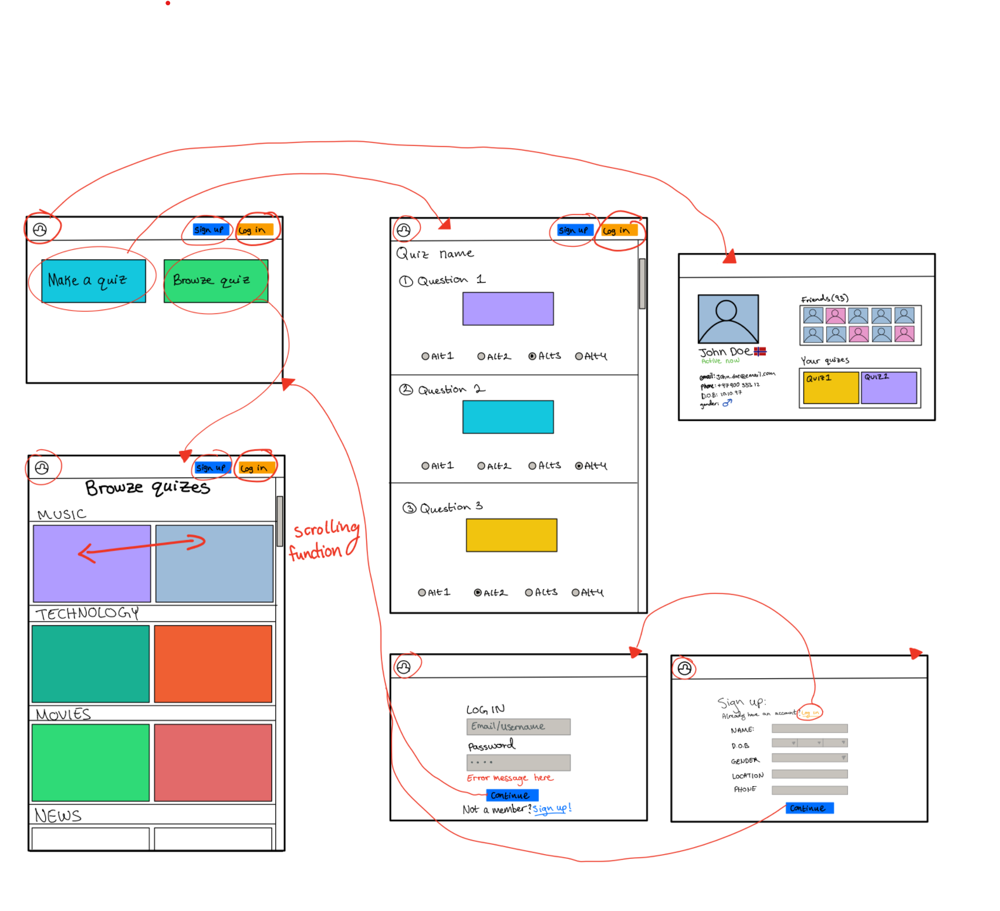

# quizapp

This project vil contain a quiz app. 

Currently, this repo will contain a simple login site, which will later be used in the quiz-app

This repo also contains testing for each layer, and is built with **maven**.

## FolderStructure

This project is contained in a 2*2 folder structure, where code and resources are seperated. The folders are following:

* **src/main/java**
* **src/main/resources**
* **test/test/java**
* **test/test/resources**

This is the standard folder structure for projects built with maven

## API-layer

The API layer is currently simple, and contains only a simple UI for logging in, along with java and JavaFX code
used to make the FXML-UI work properly. You can currently only use existing usernames and passwords.
If you input the correct username and password, you will be taken to a blank stage.

The current username and password are as follows:

Username: **gr2022**

Passord **gitlab**

The API files are found here:
**link to src/quizapp/API**

## Presistance-layer

In the presistance-layer, all classes and logic connected to saving and reading from files are located.

The presistance files are found here:
**Link to src/quizapp/presistance**

**Diagram describing the file saving:**

**Illustrative plan:**

This illustrative plan is meant to represent the functunality of our app closer to its finishing stages. The red arrows point to a new 'stage' as a result of interactions with the visual representations. 

**User stories:**
https://docs.google.com/document/d/1onM4Twf8udwkJ4Me4JwiqlhbbePsnBw3_q8_uEFCKUw/edit?ts=5f58a80c

### This project is built with maven